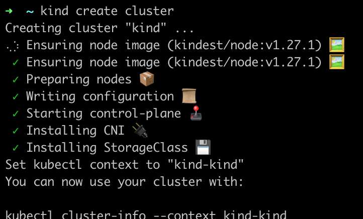
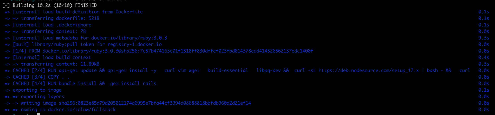
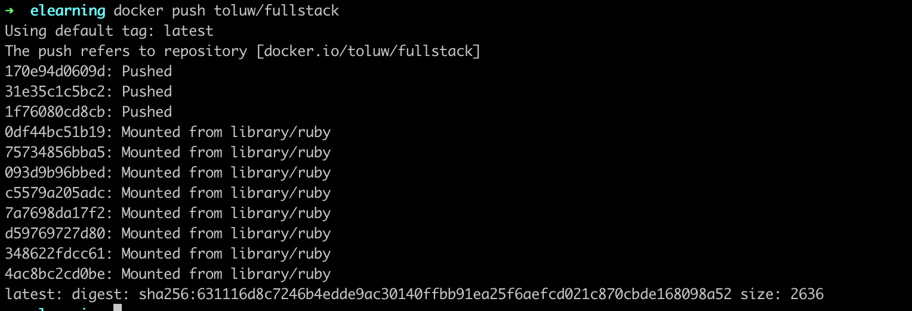
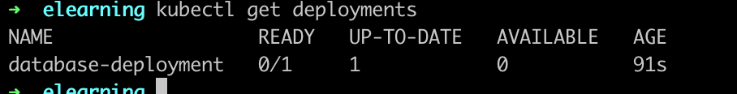
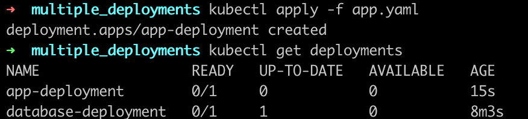
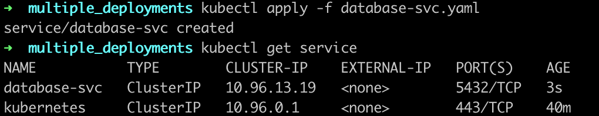
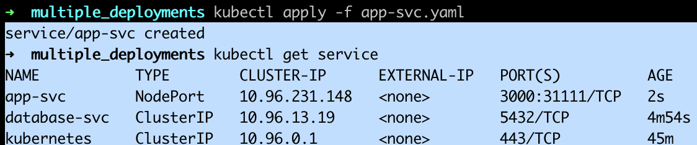

# Deploy a Full Stack Web Application
> This application provides search functionality and enables the users to search for the courses. These courses are stored and fetched from the PostgreSQL database.

1. Create a cluster. 
`kind create cluster`

2. Containerize and Push the Frontend of the Application
    - Change the directory to /elearning.
    - Create a Docker image.
    
    - Push this image to Docker Hub.
    
3. Deploy the Database
    - After I created the deployment file (*database.yaml*), I created it by 
    > `kubectl apply -f database.yaml`. This is in the multiple_Deployments directory.

    I verified the database was created
    
4. Create a Service for the Database
    - Basically replicated the same in No 3.
    
5. Deploy the Frontend of the Application
    - I also created the frontend as well using the same method as the backend.This is after creating the yaml files.
    

    
6. Create a ConfigMap
7. Access the Application
> `kubectl port-forward svc/app-svc --address 0.0.0.0 31111:3000`

    